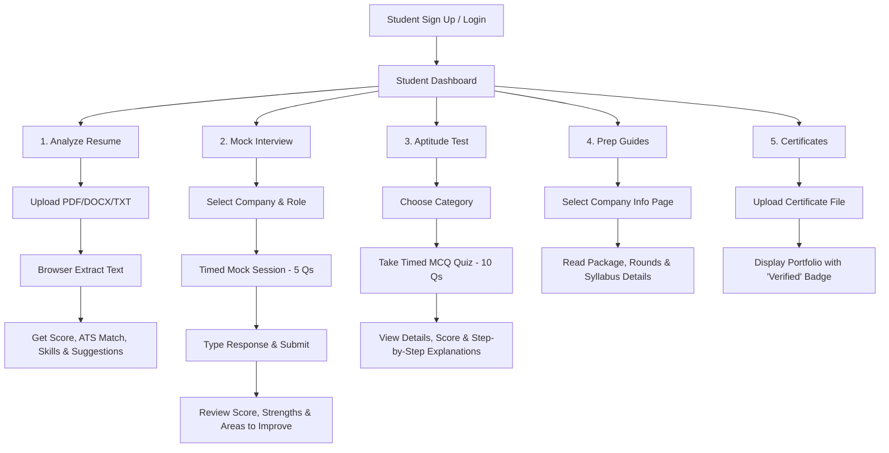
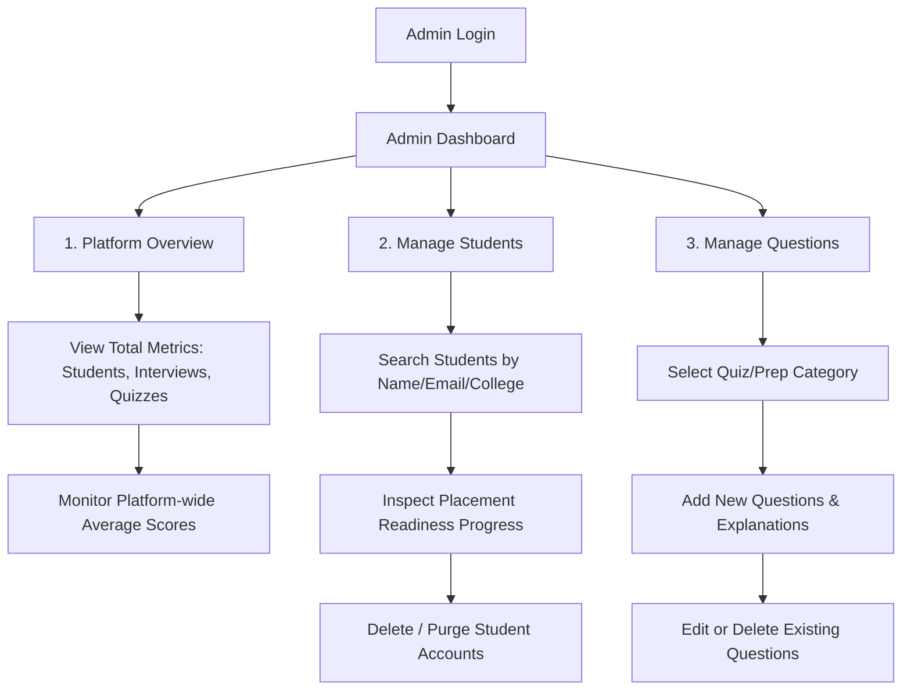

# CareerVerse – AI Placement Preparation Platform

A comprehensive full-stack web application designed to help engineering students prepare for campus placements through AI-powered resume analysis, mock interviews, timed aptitude tests, and company-specific preparation guides.

---

## 📸 Platform Outputs & Screenshots

| **Student Dashboard** | **AI Resume Analyzer** |
| :---: | :---: |
|  |  |

| **Mock Interview Simulator** | **Admin Dashboard** |
| :---: | :---: |
|  |  |

---

## 🌟 Key Features

- **Auth System**: Secure JWT-based authentication with Student & Admin roles.
- **Student Dashboard**: Personalized dashboard tracking placement readiness, recent activity, and upcoming tasks.
- **AI Resume Analyzer**: Parses resumes (PDF/DOCX/TXT) in-browser to extract skills, calculate an ATS score, and suggest improvements.
- **Mock Interview Simulator**: Timed interview environment with role-specific questions for top recruiters (TCS, Infosys, Accenture, Capgemini).
- **Aptitude Practice**: Timed multiple-choice quizzes across Quantitative, Logical, Verbal, and Programming categories with instant detailed explanations.
- **Company Preparation Guides**: Detailed selection process, syllabus, and pro-tips for major IT companies.
- **Certificate Manager**: Upload and organize technical certifications.
- **Admin Dashboard**: Manage student accounts, view platform statistics, and configure question banks.

---

## 🔄 Detailed Workflows

### 👨‍🎓 Student Workflow



1. **Authentication & Profile Registration**:
   - Register as a student by entering your name, email, password, college, branch, current academic year, and CGPA.
   - Login securely to establish your student session.

2. **Student Dashboard (Control Center)**:
   - View your customized profile summary and greeting card.
   - Track your **Placement Readiness Progress** represented by a dynamic circular progress ring (0-100%), calculated based on resume completeness, mock interview performance, aptitude attempts, and verified certifications.
   - Review platform statistics, upcoming tasks, recent activity logs, and quick navigation actions.

3. **AI Resume Analyzer**:
   - Drag and drop or browse files to upload your resume (supports PDF, DOCX, and TXT; max 5MB).
   - The application extracts the raw text directly in-browser using integrated PDF.js and Mammoth.js libraries.
   - View your results instantly:
     - **ATS Match Score & Resume Score**: visual gauge charts indicating overall quality.
     - **Extracted Profile**: parsed candidate name, email, phone, education details, technical projects, and work experience.
     - **Skill Breakdown**: lists of identified skills vs. missing skills/keywords required for IT roles.
     - **AI Feedback**: detailed strengths, weaknesses, and personalized recommendations/formatting suggestions.

4. **Mock Interview Simulator**:
   - Select your target recruiter (TCS, Infosys, Accenture, Capgemini) and job role.
   - Face 5 random questions tailored to your selection in a timed format (120 seconds per question).
   - Enter your detailed response text. The system automatically monitors time and auto-advances the question at 0:00.
   - Review the post-interview report containing your overall score out of 100, strengths, and specific areas to improve.

5. **Aptitude Practice**:
   - Choose a quiz category (Quantitative, Logical, Verbal, or Programming).
   - Complete 10 MCQs within a 30-minute time limit.
   - Submit your responses to instantly inspect your score, accuracy rate, and time taken.
   - Read step-by-step explanations and answers for every question.

6. **Company Preparation Guides**:
   - Learn the recruiting guidelines, average packages, and recruitment stages of top IT employers.
   - Access comprehensive syllabus checklists.

7. **Certificate Manager**:
   - Build a portfolio by uploading files (PDF/Image) with the certificate's title, issuer, and date.
   - Showcase verified certificates or delete expired ones.

---

### 👩‍💼 Admin Workflow



1. **Admin Dashboard (Platform Overview)**:
   - Monitor high-level metrics: Total registered students, total completed mock interviews, total aptitude tests attempted, and total uploaded certificates.
   - Review the list of recent student registrations showing joined dates and colleges.
   - Check the overall average platform interview score.

2. **Manage Students**:
   - View the detailed table showing all student profiles on the platform.
   - Review each student's name, email, academic info (college, branch, year), and their placement readiness percentage.
   - Search for specific students using the real-time filter (searchable by name, email, or college).
   - Safely remove/delete student accounts.

3. **Manage Questions (Question Bank)**:
   - Access and edit the entire database of aptitude questions and mock interview questions.
   - Filter questions using category tabs.
   - **Add New Question**: Enter the question text, options (A, B, C, D), select the correct option index, and provide a clear step-by-step explanation.
   - **Edit Question**: Modify existing questions, update option texts, or revise explanations.
   - **Delete Question**: Remove outdated questions.
   - All changes persist locally using the unified simulated backend services.

---

## 🛠️ Technology Stack

### Frontend
- **Framework**: React.js 18 (Vite)
- **Routing**: React Router v6
- **Styling**: Vanilla CSS3 (Custom Design System with Variables)
- **Icons**: React Icons (Material Design)
- **Charts/Visuals**: Recharts, React Circular Progressbar
- **Notifications**: React Toastify
- **Libraries**: Mammoth.js (DOCX parsing), PDF.js (PDF parsing)

### Backend
- **Framework**: Java Spring Boot 3.x
- **Architecture**: MVC (Model-View-Controller)
- **Database**: MySQL 8.0
- **ORM**: Spring Data JPA / Hibernate
- **Security**: Spring Security + JWT Tokens

---

## 🚀 Getting Started (Frontend Demo Mode)

The frontend is built with a robust `mockService` layer that simulates all backend interactions using `localStorage`. This allows you to run and demo the entire platform without setting up the Java backend or MySQL database.

### Prerequisites
- Node.js (v18 or higher)
- npm or yarn

### Installation & Run
1. Navigate to the frontend directory:
   ```bash
   cd frontend
   ```
2. Install dependencies:
   ```bash
   npm install
   ```
3. Start the development server:
   ```bash
   npm run dev
   ```
4. Open `http://localhost:3000` in your browser.

**Demo Credentials**:
- **Student**: `student@careerverse.com` / `student123`
- **Admin**: `admin@careerverse.com` / `admin123`

---

## 📂 Project Structure

```
careerverse/
├── frontend/                  # React Application
│   ├── src/
│   │   ├── assets/            # Images, SVGs
│   │   ├── components/        # Reusable UI components
│   │   ├── context/           # React Context (Auth)
│   │   ├── data/              # Static data (Questions, Companies)
│   │   ├── layouts/           # Dashboard shell & sidebar
│   │   ├── pages/             # Route-level components
│   │   ├── services/          # API & Mock services
│   │   ├── App.jsx            # Routing configuration
│   │   ├── main.jsx           # Entry point
│   │   └── index.css          # Global Design System
│   └── package.json
│
├── backend/                   # Spring Boot Source Code
│   ├── src/main/java/com/careerverse/
│   │   ├── config/            # Security & JWT configuration
│   │   ├── controller/        # REST API endpoints
│   │   ├── dto/               # Data Transfer Objects
│   │   ├── model/             # JPA Entities
│   │   ├── repository/        # Spring Data Repositories
│   │   └── service/           # Business logic
│   └── pom.xml
│
└── database/                  # SQL Scripts
    └── schema.sql             # Complete MySQL table definitions
```

---

## 🎨 UI/UX Design Principles

- **Corporate Aesthetic**: Inspired by LinkedIn and Microsoft products using a clean white background, `#2563EB` (Blue) primary accent, and `#F8FAFC` secondary backgrounds.
- **Glassmorphism & Shadows**: Subtle box-shadows and blur effects for depth.
- **Micro-interactions**: Hover states, smooth transitions, and pulse animations for critical UI elements like timers.
- **Responsive**: Fully responsive CSS Grid and Flexbox layouts for desktop, tablet, and mobile viewing.

---

*Built as a final year engineering project demonstrating proficiency in Modern Web Development, UI/UX Design, Object-Oriented Programming, and Full Stack Integration.*
